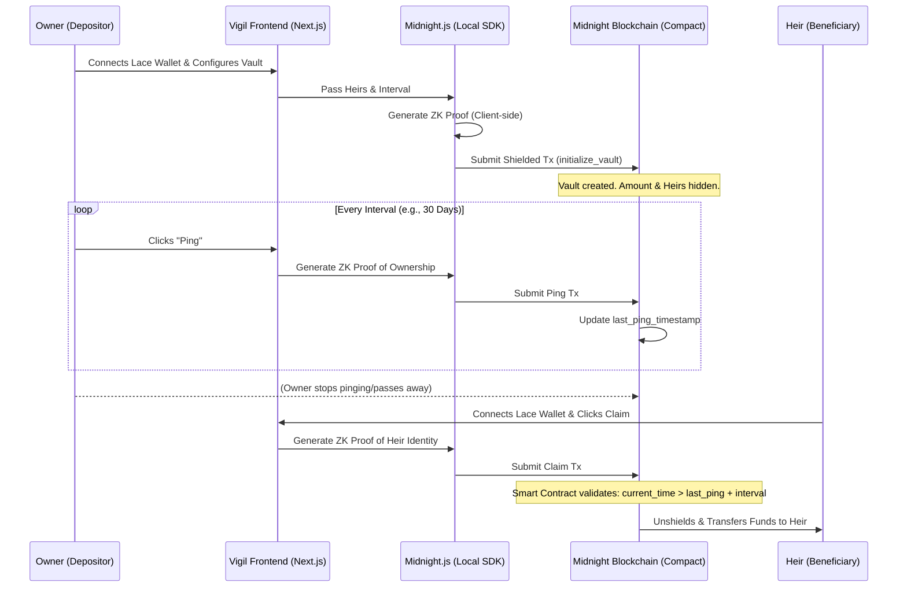

# Vigil 🕯️
**Zero-Knowledge Inheritance & Trustless Proof-of-Life on the Midnight Blockchain**

## 📖 What is Vigil?
**Vigil** is a decentralized, privacy-preserving inheritance protocol (often referred to as a "Dead Man's Switch") built entirely on the **Midnight Blockchain**. 

It allows users to lock their crypto assets into a smart contract that requires a periodic "proof of life" (a simple transaction ping). If the user fails to ping the contract within their specified timeframe (e.g., 6 months), the contract assumes the user has passed away or lost access, and automatically unlocks the funds for designated heirs.

### The Problem (Why standard Web3 fails here)
Building a Dead Man's Switch on Ethereum, Solana, or Cardano is trivial, but **extremely dangerous**. Public blockchains expose everything. If you deploy an inheritance contract on a public chain:
1. **Targeting:** Anyone in the world can see exactly how much money is locked inside.
2. **Doxxing:** Anyone can see the exact wallet addresses of your heirs (your family/friends).
3. **Extortion:** Malicious actors can track the countdown timer. Knowing exactly who gets the money and when makes the heirs massive targets for phishing, extortion, or physical harm.

### The Vigil Solution (Why Midnight is required)
Vigil leverages **Midnight's Zero-Knowledge (ZK) proofs and shielded state** to fix this. 
When a user sets up a Vigil vault:
- The **Amount** of assets locked is shielded.
- The **Identities/Addresses** of the heirs are shielded.
- The **Countdown Timer** and conditions can be obfuscated.
No one on the blockchain knows who the money belongs to, who it is going to, or how much is there until the exact moment the inheritance is claimed.

---

## 🏗️ Vigil System Architecture
This diagram illustrates how the components of Vigil interact. All Zero-Knowledge proofs are generated on the user's device (client-side) to ensure secrets never leak to the network.



## 🛠️ Tech Stack
Vigil is a full-stack dApp combining a Web2-like user experience with advanced Web3 cryptography.

### 1. Smart Contracts (The Backend)
- **Language:** **Compact** (Midnight's native TypeScript-like language for ZK smart contracts).
- **Network:** **Midnight Preview / PreProd Testnet**.
- **Role:** Handles the shielded state (balances, heir lists) and validates the ZK proofs submitted by the frontend.

### 2. The Frontend (The Client)
- **Framework:** **Next.js (React)** with TypeScript.
- **Styling:** **Tailwind CSS** (for a sleek, dark-mode, high-security UI aesthetic).
- **SDK:** **Midnight.js** (Used to interact with the Midnight network, generate ZK proofs locally on the user's machine, and submit transactions).
- **Wallet Integration:** **Lace Wallet** (Input Output Global's wallet with Midnight support).

---

## 🔬 Microscopic Details: Smart Contract Mechanics
The Compact smart contract will have the following internal structure:

### Shielded State (Private Data)
*   `owner_key`: The cryptographic commitment to the owner's identity.
*   `heir_commitments`: A shielded map/array of the heirs' wallet addresses and their respective inheritance percentages.
*   `vault_balance`: The total shielded tokens locked in the contract.
*   `last_ping_timestamp`: The last time the owner proved they were alive.
*   `interval`: The time (in blocks/seconds) allowed before the switch triggers.

### Core Contract Functions
1.  **`initialize_vault(heirs, interval, amount)`**
    *   *Action:* User deposits tokens, sets the interval, and assigns heirs.
    *   *ZK Predicate:* Proves the user has sufficient funds and correctly hashes the heirs' data into the shielded state.
2.  **`ping()`**
    *   *Action:* User sends a transaction to reset the `last_ping_timestamp`.
    *   *ZK Predicate:* Proves the caller is the `owner_key` without revealing the `owner_key` to the network.
3.  **`cancel_vault()` (Edge Case Handling)**
    *   *Action:* The owner decides to cancel the vault and withdraw their assets while still alive.
    *   *ZK Predicate:* Proves the caller is the `owner_key`.
4.  **`claim_inheritance(heir_address)`**
    *   *Action:* An heir attempts to claim the funds.
    *   *Logic:* The contract checks if `current_time > last_ping_timestamp + interval`. If true, the contract verifies the ZK proof that the caller is inside the `heir_commitments`. If valid, it transfers the shielded funds to the heir.

---
*For the step-by-step master plan of how to build this, see `DEVELOPMENT_PLAN.md`.*

## 🚀 Quick Start & Setup Guide (For Judges)

We have prioritized making Vigil extremely easy to evaluate. You can run the entire frontend UI on your local machine using Docker or Node.js. 

**✨ Zero-Friction Testing Feature:** If you do not have the Midnight Lace Wallet extension installed on your local browser, our application will gracefully inject a **Mock Wallet Connection**. This guarantees you can fully explore the UI, Dashboard, and Claim logic without needing to configure a DevNet environment!

### Option A: Run with Docker (Recommended)
This is the fastest way to get the production build running.

```bash
# 1. Clone the repository
git clone https://github.com/Kushal25Gupta/Vigil.git
cd Vigil/frontend

# 2. Build the production Docker image
docker build -t vigil-frontend .

# 3. Run the container
docker run -p 3000:3000 vigil-frontend
```
*Open [http://localhost:3000](http://localhost:3000) in your browser.*

### Option B: Run Manually (Node.js)
Ensure you have Node.js v18 or higher installed.

```bash
# 1. Clone the repository
git clone https://github.com/Kushal25Gupta/Vigil.git
cd Vigil/frontend

# 2. Install dependencies
npm ci

# 3. Start the development server
npm run dev
```
*Open [http://localhost:3000](http://localhost:3000) in your browser.*

### How to Test the MVP Flow
1. **Authentication:** Click **"Connect Wallet"** in the navigation bar. Accept the mock wallet prompt if you do not have the Lace extension.
2. **Owner Flow:** Navigate to **"Dashboard"**. You will see the active vault interface. Click **"Ping (Proof of Life)"** to simulate the local generation of a Zero-Knowledge ownership proof.
3. **Heir Flow:** Navigate to the **"Claim Portal"**. Enter a test Vault ID (e.g. `0x8fB3`) and click **"Verify & Unshield Funds"** to simulate the smart contract time-lock validation and ZK identity proof generation.

---

## 🏗️ Vigil System Architecture
